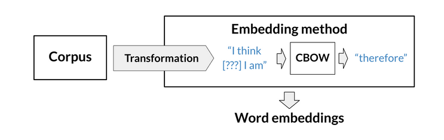
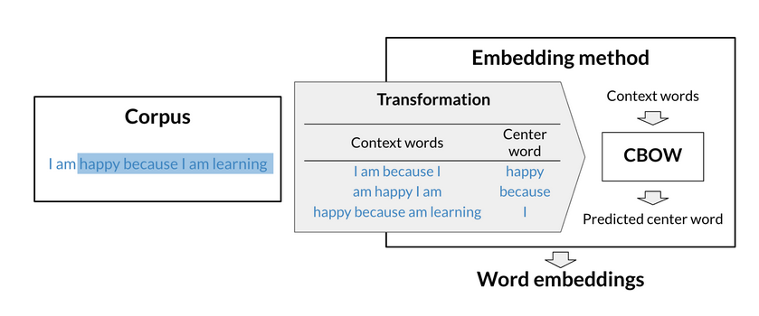

# Word2Vec : Creating Word Embeddings
Author : Chenzhi Sun

## Description

This project focuses on the development and application of the Word2Vec model, specifically using the Continuous Bag of Words (CBOW) approach, to create word embeddings. Word embeddings are detailed vector representations of words that encapsulate their meanings, syntactic properties, and semantic relationships within a given corpus.

By employing the CBOW model, our Word2Vec implementation predicts the target word based on the context (with the txt of shakespeare), allowing us to effectively capture the contextual essence of words. The repository includes all necessary code and datasets to train the CBOW model, evaluate its performance, and apply it to various natural language processing tasks such as text classification and sentiment analysis.

We provide comprehensive instructions on setting up, training, and evaluating the model, offering researchers and developers a robust toolkit for harnessing word embeddings to enhance machine learning applications.

## Files
* **Word2Vec.ipynb**: notebook that contains the complete code for training the Word2Vec model using the CBOW architecture. This script includes preprocessing of text data, model training, visualization of embeddings, and evaluation of model performance.
* **corpus**: A directory containing the text files to be processed. These files serve as the training data for generating word embeddings.
* **images**: A directory with explanatory images and outputs generated by the program.

## The Continuous Bag of Words Model (CBOW) 

To create word embeddings, we need a corpus and a learning algorithm, a simple neural net in this case.  The embeddings are a set of vectors that will be extracted from the neural net once it is trained, and are actually a *by-product* of the following task : the main objective of the CBOW model is to predict a missing word based on its surrounding words. 

The CBOW model architecture tries to predict the current target word (the center word) based on context words (the surrounding words). A simple example :
> **“the quick brown fox jumps over the lazy dog”**.

The sentence will be transformed into a series of examples for the model to train on : each example will consist of a (context_window, target_word) tuple.  Considering a context window of size $C=2$ (2 words to the left, 2 to the right, so 4 total) we would obtain :
> Ex. 1 : (*[the, quick, fox, jumps]*, brown)  
> Ex. 2 : (*[quick, brown, jumps, over]*, fox)  
> Etc ...

The neural net's task will be to predict the target word based on the context window words.

This means we can model this problem as a classification task such that we take in the context words as our input (X) and try to predict the target word (Y) out of all the possible words in the vocabulary.  This is essentialy a *multiclass* classification task (only 1 of the possible classes is correct), where a class is equivalent to a word in the vocabulary.  Here is an overview of the process : 

